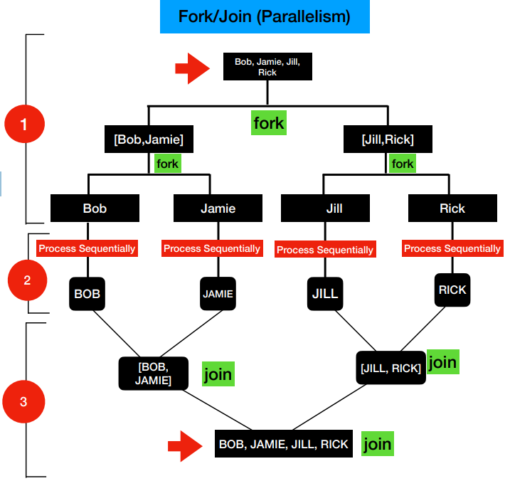

# Parallel And Asynchronous Programming in Java

## Why Parallel and Asynchronous Programming ?
We are living in a fast-paced environment. In Software Programming:
- Code that we write should execute faster
- Goal of Asynchronous and Parallel Programming
- Provide Techniques to improve the performance of the code

**Developer needs to learn programming patterns to maximize the use of multiple cores.
Apply the Parallel Programming concepts using Parallel Streams.**

**Blocking I/O calls are common in MicroServices Architecture. This also impacts the latency of the application.
Apply the Asynchronous Programming concepts using CompletableFuture.**

## Concurrency vs Parallelism

**In case of Single Core machine, Threads work in Interleaved Fashion. CPU scheduler takes care of which thread to 
execute and when. Whereas in case Multi Core, Threads work simultaneously.**

## Threads API
- Threads API got introduced in Java1.
- Threads are basically used to offload the blocking tasks as background tasks.
- Threads allowed the developers to write asynchronous style of code.

### Thread API Limitations
- Requires a lot of code to introduce asynchronous calling
- Runnable, Thread
- Require additional properties in Runnable
- Start and Join the thread
- Low level
- Easy to introduce complexity in to our code.
- Threads are expensive 
- Threads have their own runtime-stack, memory, registers and more. This is why creating and destroying the threads are expensive operations.

## Thread Pool
- Thread Pool is a group of threads created and readily available
- CPU Intensive Tasks
- ThreadPool Size = No of Cores, because threads will be busy performing the CPU intensive tasks.
- I/O task
- ThreadPool Size > No of Cores, because most of the time, threads will be waiting to get the data from downstream.
- What are the benefits of thread pool?
- No need to manually create, start and join the threads
- Achieving Concurrency in your application

## ExecutorService
- Released as part of Java5
- ExecutorService in Java is an **Asynchronous Task Execution Engine**
- It provides a way to asynchronously execute tasks and provides the results in a much simpler way compared to thread
- This enabled coarse-grained task based parallelism in Java

### Working of an Executor Service
- Executor service has a thread pool, which is a group of threads readily available to execute tasks.
- It also has a Work Queue and Completion Queue.
- Work Queue acts as a blocking queue. All the tasks are placed in the work queue for the thread present in thread pool to pick and execute.
- This returns a Future which is something we can think is like a proxy for which we will get result in later.
- Once the thread completes the execution it places the result in completion queue, and we can get result from this queue using the Future.

### Limitations of ExecutorService
- Designed to Block the Thread
- No better way to combine futures

## Fork/Join Framework
- This got introduced as part of Java7
- This is an extension of ExecutorService
- Fork/Join framework is designed to achieve Data Parallelism
- ExecutorService is designed to achieve Task Based Parallelism, this means in Executor service submit function we pass the entire the function and
thread executes and gives us the result. Different tasks run in parallel. So hence Task Based Parallelism.

### What is Data Parallelism ?
- Data Parallelism is a concept where a given Task is recursively split into SubTasks until it reaches the least possible size 
and execute those tasks in parallel.
- Basically it uses the divide and conquer approach.

**Fork/Join Framework has a ForkJoin Pool to support Data Parallelism**

### ForkJoinPool
- It has shared work queue, to which clients submit the tasks.
- Other thing present in ForkJoin Pool is worker threads and each thread has a double ended work queue also called "deck".
- Clients submit the ForkJoinTask to the shared queue. ForkJoinPool only works with and accept ForkJoinTask.
- ForkJoinTask has the ability to split the task into subtask and join them after the execution is completed.
- Each worker thread, continuously poll the shared work queue for new tasks. And the task is taken by one of the worker thread.
- Task in the "deck" are processed in LIFO order. Because it improves the locality and cache performance for the execution for
this task.
- If the task can be further divided into subtasks, it will split and will be placed in the same thread.
- Here comes a concept of "Work Stealing" for better utilization of multi-threads. Work Stealing is a concept where each
worker thread keeps on watching the other threads deck for any unprocessed tasks.
- Currently, only one thread is having all the subtasks, So all the other threads will try to steal the unprocessed tasks
from the deck of thread1 from the other end so that currently executing task is not affected.
- This is one of the reason we have double ended work queue.
- As soon as all the tasks are completed the result is shared back to the client.

**Common ForkJoin Pool is shared by the whole process**

### ForkJoin Task
- ForkJoin Task represents part of the data and its computation
- Type of tasks to submit to ForkJoin Pool
- ForkJoinTask
- RecursiveTask -> Task that returns a value
- RecursiveAction -> Task that does not return a value

### Limitations of Fork/Join Framework
- Complex code and not developer friendly.

## Streams API & Parallel Streams

### Streams API
- Streams API got introduced in Java 8
- Streams API is used to process a collection of Objects
- Streams in Java are created by using the stream() method

### ParallelStreams
- This allows your code to run in parallel
- ParallelStreams are designed to solve **Data Parallelism**
- Just invoke parallelStream() instead of stream() to process data in parallel.
- Apart from this code almost remain same for stream and parallel stream.

## Why Unit Tests?
- Unit Testing allows you to programmatically test your code
- Manual Testing slows down the development and delivery
- Unit Testing allows the developer or the app team to make enhancements to the existing code easily and faster

## Sequential/Parallel Functions in Streams API

### sequential() and parallel()
- Streams API are sequential by default
- sequential() -> Executes the stream in sequential
- parallel() -> Executes the stream in parallel
- Both the functions() changes the behavior of the whole pipeline, this means if we have a parallelStream, 
and we invoke sequential() over it. Then whole pipeline will work sequentially. Same with stream, if we invoke parallel()
over it then whole pipeline will execute in parallel.
- Use these functions when we want to evaluate performance between parallel and sequential workflow.

## ParallelStreams How it works ?
parallelStream()
- Split the data in to chunks
- Execute the data chunks
- Combine the result

### Split
- Data Source is split into small data chunks
- Example - List Collection split into chunks of elements to size 1
- This is done using Spliterators
- For ArrayList, the Spliterator is ArrayListSpliterator 

### Execute 
- Data chunks are applied to the Stream Pipeline and the Intermediate operations executed in a Common ForkJoin Pool

### Combine
- Combine the executed results into a final result
- Combine phase in Streams API maps to terminal operations
- Uses collect() and reduce() functions. ex: collect(toList())

### Spliterator in ParallelStreams
- Data source is split into multiple chunks by the Spliterator
- **Each and every collection has a different Spliterator Implementation**
- Performance differ based on the implementation

### Summary - Spliterator in ParallelStreams
- Invoking parallelStream() does not guarantee faster performance of your code
- Need to perform additional steps compared to sequential: Splitting , Executing and Combining

**Recommendation - Always compare the performance before you use parallelStream()**

## Parallel Streams - Final Computation Result Order
- The order of the collection depends on:
- Type of Collection
- Spliterator Implementation of the collection
- Example : ArrayList
- Type of Collection - Ordered
- Spliterator Implementation - Ordered Spliterator Implementation
- Example : Set
- Type of Collection - UnOrdered
- Spliterator Implementation - UnOrdered Spliterator Implementation

## Collect vs Reduce

**The reduce() function performs an immutable computation throughout in each and every step.**

### Identity in reduce()
- Identity gives you the same value when its used in the computation
- Addition: Identity = 0
- 0 + 1 => 1
- 0 + 20 => 20
- Multiplication : Identity = 1
- 1 * 1 => 1
- 1 * 20 => 20
- **reduce() is recommended for computations that are associative**

## Modifying Default parallelism
- Two options:
- Either via code set this system property. System.setProperty("java.util.concurrent.ForkJoinPool.common.parallelism", "100");
- or pass this as environment variable. -Djava.util.concurrent.ForkJoinPool.common.parallelism=100

## Parallel Streams - When not to use them ?
- Parallel Streams
- Split
- Execute
- Combine
- When Split and combine operation is heavy then try to avoid using parallel streams.
- Data set is small
- Auto Boxing and Unboxing does not perform better
- Stream API operators -> iterate(), limit()
